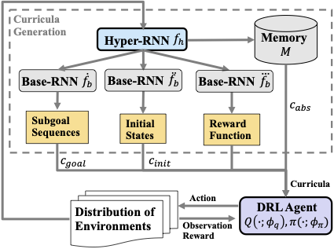

# Learning Multi-Objective Curricula for Robotic Policy Learning

This repository is the official implementation of paper Learning Multi-Objective Curricula for Robotic Policy Learning 




## Requirements

To install requirements:

```setup
pip install -r src/requirements.txt
```

To install depdencies, we recommend to use a conda virtual environment.

```setup
conda create --name moc python=3.7
```

## Training

To train the model(s) in the paper, run this command:

```train
cd src
python train_causal_world.py --task-name <task name> --total-times 10000000 --num-of-envs 5 --device <cpu/cuda>
```
**Note:** To train an ablation experiment, just turn off the component in the training arguments.

To train with model without hyper-LSTM, run:

```train
python train_causal_world.py --task-name <task name> --total-times 10000000 --num-of-envs 5 --device <cpu/cuda> --meta 0
```
To train with model with memory only, run:

```train
python train_causal_world.py --task-name <task name> --total-times 10000000 --num-of-envs 5 --device <cpu/cuda> --memory-only 1
```
To train with model with goal curriculum only, run:

```train
python train_causal_world.py --task-name <task name> --total-times 10000000 --num-of-envs 5 --device <cpu/cuda> --goal-curriculum 1
```

To train with model with initial curriculum only, run:

```train
python train_causal_world.py --task-name <task name> --total-times 10000000 --num-of-envs 5 --device <cpu/cuda> --initial-curriculum 1
```

To train with model without reward shaping, run:

```train
python train_causal_world.py --task-name <task name> --total-times 10000000 --num-of-envs 5 --device <cpu/cuda> --shaping 0
```

To train PPO, run:

```train
python train_ppo.py --task-name <task name> --total-times 10000000 --num-of-envs 5 --device <cpu/cuda>
```

**Training parameters**

| Parameters        | Meaning           |
| ------------- |:-------------:|
| seed-num      | The number of seed |
| num-of-env     | The number of processes used for training |
| task-name | The name of causalworld tasks     |
| total-times | Total training timesteps. (We use 10000000 steps in our paper) |
| device | Using CPU or GPU.(option: cpu or cuda)|

Causalworld tasks options:
1. picking
2. pushing
3. pick_and_place
4. stacking2
5. reaching

## Evaluation

To evaluate my model using the pre-trained model, run:

```eval
cd src
python train_causal_world.py --load-dir <model dir> --task-name <task-name>
```

## Pre-trained Models

You can download pretrained models here:

- [Pre-trained models](https://drive.google.com/drive/folders/1gQHrabDSze2nhY5gRDkFc9p6HSJYGxTZ?usp=sharing) trained on CausalWorld with parameters showed in Appendix. 

**Note**: the pretrained model for MOC DRL in all tasks is included in folder src/models.

## Results

Our model achieves the following performance on CausalWorld:


| Model name               | Reaching          | Picking         | Pick_and_place | Pushing        | Stacking2      |
| ------------------------ |-------------------| --------------- |--------------- |--------------- |--------------- |
| MOC DRL (With memory)    | 1235.79+/-(48.67) | -4.27+/-(0.27)  | 19.32+/-(2.64) | 2.25+/-(2.14)  | 10.47+/-(0.36) |
| MOC DRL (Without memory) | 1101.49+/-(32.92) | -4.30+/-(0.30)  | -0.98+/-(0.16) | -2.53+/-(0.09) | -5.33+/-(0.21) |
| Independent Curriculum   | 1084.76+/-(25.64) | -5.37+/-(0.09)  | -2.98+/-(0.71) | -3.67+/-(0.07) | -7.52+/-(0.36) |
| Memory-only              | 828.17+/-(17.64)  | -13.39+/-(1.78) | -3.37+/-(0.06) | -4.58+/-(0.51) | -7.36+/-(0.47) |
| One Curriculum           | 865.00+/-(77.06)  | -7.61+/-(0.19)  | -5.20+/-(0.49) | -3.67+/-(0.46) | -6.99+/-(0.28) |
| PPO                      | 724.06+/-(5.03)   | -8.32+/-(0.21)  | -6.64+/-(0.15) | -6.64+/-(0.17) | -8.78+/-(0.04) |

The column shows the mean episode rewards plus-minus standard deviation at final stage.

## Contributing
MIT License

Permission is hereby granted, free of charge, to any person obtaining a copy
of this software and associated documentation files (the "Software"), to deal
in the Software without restriction, including without limitation the rights
to use, copy, modify, merge, publish, distribute, sublicense, and/or sell
copies of the Software, and to permit persons to whom the Software is
furnished to do so, subject to the following conditions:

The above copyright notice and this permission notice shall be included in all
copies or substantial portions of the Software.

THE SOFTWARE IS PROVIDED "AS IS", WITHOUT WARRANTY OF ANY KIND, EXPRESS OR
IMPLIED, INCLUDING BUT NOT LIMITED TO THE WARRANTIES OF MERCHANTABILITY,
FITNESS FOR A PARTICULAR PURPOSE AND NONINFRINGEMENT. IN NO EVENT SHALL THE
AUTHORS OR COPYRIGHT HOLDERS BE LIABLE FOR ANY CLAIM, DAMAGES OR OTHER
LIABILITY, WHETHER IN AN ACTION OF CONTRACT, TORT OR OTHERWISE, ARISING FROM,
OUT OF OR IN CONNECTION WITH THE SOFTWARE OR THE USE OR OTHER DEALINGS IN THE
SOFTWARE.
